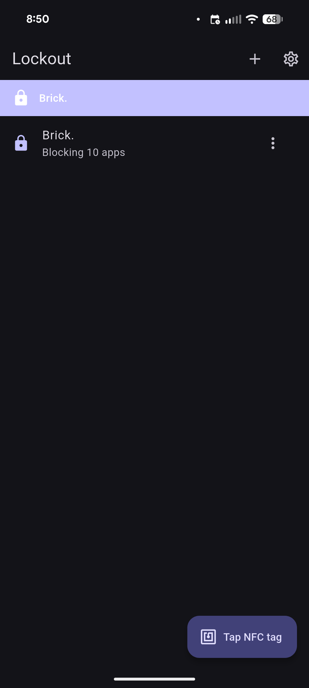
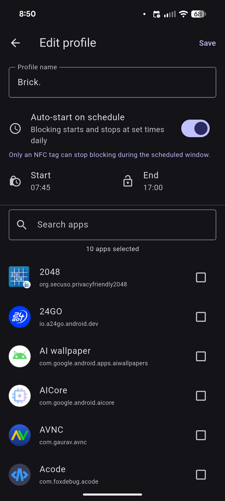
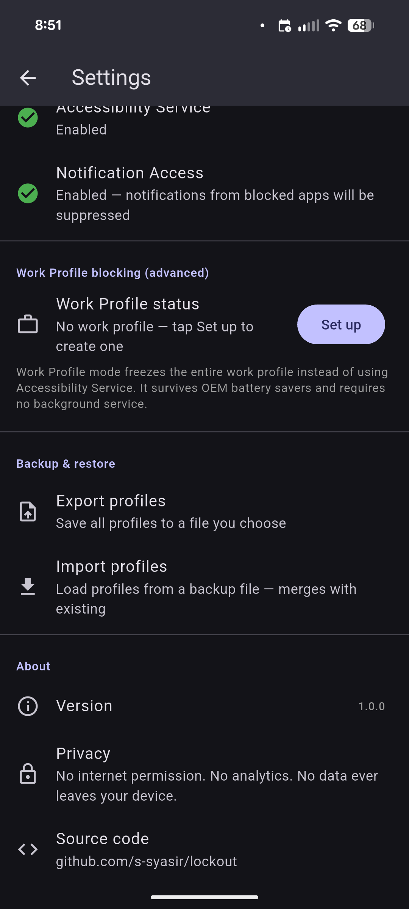

# Lockout

Open-source NFC-triggered app blocker for Android. No Play Services required. Works on GrapheneOS, CalyxOS, and microG.

**Tap an NFC tag → your distracting apps are blocked until you tap it again.**

---

## Screenshots

| Home | Profile edit | Settings |
|:---:|:---:|:---:|
|  |  |  |

---

## Features

| | |
|---|---|
| **NFC tag trigger** | Write a profile to a cheap NTAG213 tag (~$0.50). Tap once to start blocking, tap again to stop. **Stopping requires the NFC tag** — there is no in-app stop button. |
| **Scheduled blocking** | Set a daily start and end time per profile. Blocking kicks in automatically and can only be cancelled mid-window by scanning the NFC tag. A notification fires when the session starts. |
| **Notification suppression** | Notifications from blocked apps are silently cancelled while a session is active. Requires Notification Access permission (optional, enable via Settings). |
| **Multiple profiles** | Focus, Bedtime, Work — each with its own app list and optional schedule. |
| **Backup & restore** | Export all profiles to a JSON file (any location you pick). Re-import after a reinstall — your existing NFC tags keep working because profile IDs are preserved. |
| **No internet permission** | Ever. No analytics, no telemetry, no crash reporting. Declared in the manifest and intentionally permanent. |
| **No Google Play Services** | Pure AOSP. Works on de-Googled ROMs. |
| **Session persistence** | Blocking survives app restarts and phone reboots. |

---

## How it works

```
NFC tag tap (or scheduled alarm)
    │
    ▼
Android NDEF_DISCOVERED intent → MainActivity   (or AlarmManager → ScheduleReceiver)
    │  extracts lockout:profile:<uuid> from tag payload
    ▼
Flutter HomeScreen picks up pending tag on resume
    │  looks up profile in local storage
    ▼
BlockingChannel (MethodChannel)
    │  persists package list to native SharedPreferences
    ▼
AccessibilityService (Kotlin)
    │  TYPE_WINDOW_STATE_CHANGED fires on every foreground change
    ▼
Blocked package in foreground?
    └─ yes → ACTION_MAIN / CATEGORY_HOME  (instant redirect, no root needed)
```

Tag payload: `lockout:profile:<uuid>` as an NDEF TextRecord. Fits any NTAG213 tag with room to spare.

---

## Requirements

- Android 8.0+ (API 26)
- NFC hardware *(optional — profiles can be started manually by tapping them in the app; stopping always requires NFC)*
- Accessibility Service permission *(one-time, guided on first launch)*
- Notification Access permission *(optional — suppresses notifications from blocked apps; enable via Settings → Notification Access)*
- Alarms & reminders permission *(optional — required for exact scheduled start times on Android 12+; app prompts when you save a schedule)*

---

## Build

```bash
flutter pub get
flutter run           # debug on connected device
flutter build apk     # release APK (unsigned, debug key)
```

Or use the included scripts (require a connected device via ADB):

```bash
./run-debug.sh        # flutter run (debug, live reload)
./run-install.sh      # build release APK + adb uninstall + fresh install (wipes app data)
```

No Play Store signing config needed for local development.

---

## Project structure

```
lib/
  main.dart                       startup, session resume on boot
  models/
    profile.dart                  Profile model + JSON serialisation (inc. schedule fields)
    app_info.dart                 AppInfo (packageName, appName)
  services/
    storage_service.dart          SharedPreferences: profiles + active session
    blocking_service.dart         MethodChannel bridge to native layer
    backup_service.dart           JSON export/import via system file picker
    nfc_service.dart              flutter_nfc_kit read/write wrapper
  screens/
    home_screen.dart              profile list, session banner, NFC FAB
    profile_edit_screen.dart      create/edit profile, schedule picker, app picker
    onboarding_screen.dart        first-run Accessibility permission walkthrough
    settings_screen.dart          permissions, backup/restore, about

android/…/kotlin/com/lockout/app/
  MainActivity.kt                     NFC intent dispatch, FlutterEngine setup
  BlockingChannel.kt                  MethodChannel handler, app list, icon fetch, schedule alarms
  BlockingService.kt                  AccessibilityService — the actual blocking core
  NativePrefs.kt                      Centralised native SharedPreferences helper
  FlutterPrefs.kt                     Reads/writes Flutter's SharedPreferences from native code
  ScheduleReceiver.kt                 BroadcastReceiver — fires start/stop alarms, reschedules daily
  BootReceiver.kt                     BroadcastReceiver — reschedules alarms + resumes blocking after reboot
  LockoutNotificationListener.kt      NotificationListenerService — suppresses notifications from blocked apps
  LockoutAdminReceiver.kt             DeviceAdminReceiver for Work Profile provisioning
```

---

## Key architecture decisions

**AccessibilityService, not UsageStatsManager**
UsageStatsManager requires polling (battery drain + coarse timing). `TYPE_WINDOW_STATE_CHANGED` fires synchronously — zero polling, sub-100 ms response.

**Send home, not force-stop**
Apps cannot force-stop other apps without root. `ACTION_MAIN / CATEGORY_HOME` is instant, reliable, and non-destructive to the target app's state.

**Profile ID on the tag, not the full profile**
NTAG213 has ~144 bytes. A UUID is 36 bytes. The profile lives in app storage; the tag is a key. You can rename or edit a profile at any time without rewriting the tag. Backup/restore preserves UUIDs, so existing tags keep working after a reinstall.

**Dual SharedPreferences (Flutter + native)**
If an OEM battery saver kills and restarts the `AccessibilityService` without relaunching the Flutter engine, the service restores its block list from `NativePrefs` in `onServiceConnected`. `FlutterPrefs` lets the `ScheduleReceiver` and `BootReceiver` read profile data and write session state without the Flutter engine ever starting.

**Scheduled blocking uses AlarmManager, not a background service**
`setExactAndAllowWhileIdle` fires the receiver even in Doze mode. Each alarm reschedules itself for the next day on receipt. The `BootReceiver` re-registers all alarms on reboot and starts blocking immediately if the current time falls within a scheduled window.

---

## Roadmap

- **Schedule indicator on profile tiles** — small clock icon on the home screen to show a profile has an active schedule, without opening the edit screen.

### Implemented but experimental

- **Work Profile DPC blocking** — `DevicePolicyManager` freezing as a more reliable alternative for OEM devices with aggressive battery savers (Samsung, Xiaomi). Accessible via Settings → Work Profile blocking (advanced). Not tested end-to-end.

---

## License

MIT

<!-- 
  👀 you found it.
  this app was originally called BrickedUp.
  some names are better left locked away.
-->
